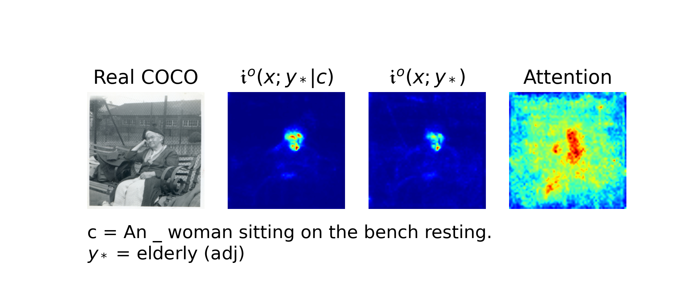

# Interpretable Diffusion via Information Decomposition
This paper illuminates the fine-grained relationships learned by diffusion
models by noticing a precise relationship between diffusion and information
decomposition. We exploit these new relations to measure the compositional understanding of diffusion
models, to do unsupervised localization of objects in images, and to measure
effects when selectively editing images through prompt interventions.

$$
\mathfrak{i}^o(x;y) \equiv \frac{1}{2} \int \mathbb E_{p(\epsilon)} \left[|| \hat\epsilon_\alpha(x_\alpha) - \hat\epsilon_\alpha(x_\alpha | y) ||^2 \right] d\alpha
$$

Paper Link: [https://arxiv.org/abs/2310.07972](https://arxiv.org/abs/2310.07972)


Video Link: [https://iclr.cc/virtual/2024/poster/18458](https://iclr.cc/virtual/2024/poster/18458)

## BibTex
```cite
@inproceedings{
kong2024interpretable,
title={Interpretable Diffusion via Information Decomposition},
author={Xianghao Kong and Ollie Liu and Han Li and Dani Yogatama and Greg Ver Steeg},
booktitle={The Twelfth International Conference on Learning Representations},
year={2024},
url={https://openreview.net/forum?id=X6tNkN6ate}
}
```

## Environmnet Setup
Install dependencies by running:
```install dependencies
conda create --name infodp python=3.10
conda activate infodp
conda install pytorch torchvision torchaudio pytorch-cuda=11.8 -c pytorch -c nvidia
conda install -c "nvidia/label/cuda-11.8.0" cuda-toolkit
git clone git@github.com:kxh001/Info_Decomp.git
cd Info_Decomp
pip install -e .
```
The [`daam`](https://github.com/castorini/daam) repository specifically requires `diffusers==0.16.1`, but `stablediffusion.py` only supports `diffusers>=0.19`.
Thus, we recommend users to experiment with `daam` separately. 
```installDAAM
git clone https://github.com/castorini/daam
Manually change requirements.txt: 'diffusers==0.16.1' ==> 'diffusers==0.20.0', 
'transformers==4.27.4' ==> 'transformers>=4.27.4', 'accelerate==0.18.0' ==> 'accelerate>=0.18.0'
pip install -e daam
```

## Dataset Setup

### ARO Benchmark Datasets

`VG-Relation`, `VG-Attribution`, and `COCO` datasets will be automatically downloaded & preprocessed when running the evaluation scripts for the first time.

The `Flickr-30K` dataset should be manually downloaded via [this form](https://forms.illinois.edu/sec/229675). Please refer to `utils/aro_datasets.py` for more details.

N.B. the `COCO` dataset used for the ARO benchmark is the 2014 variant, while our segmentation and prompt intervention results are developed with the 2017 variant. This choice is made to ensure consistency with the ARO and the DAAM implementations respectively.

### MS-COCO Datasets
Download MS-COCO datasets by running:
```download datasets
mkdir ./datasets # make sure the repo have this directory and corresponding CSV file.
wget http://images.cocodataset.org/zips/val2017.zip -O coco_val2017.zip
wget http://images.cocodataset.org/annotations/annotations_trainval2017.zip -O coco_ann2017.zip
unzip coco_val2017.zip -d ./datasets/coco/
rm coco_val2017.zip
unzip coco_ann2017.zip -d ./datasets/coco/
rm coco_ann2017.zip
```

### COCO-IT Dataset
Generate COCO-IT.csv by running:
```
python ./datasets/coco_it_generator.py
```
We also provide COCO-IT.csv, COCO100-IT.csv and COCO-WL.csv under './datasets/coco'. 

## Evaluation
After downloading the datasets, navigate to './Info_Decomp' as a working directory, then run:
### Relation Testing
1. evaluate ITD retrieval on visual-genome datasets. `{Dataset}`: options from `relation` and `attribution`
```eval vg
python ./scripts/eval_retrieval.py --dataset {Dataset} --batch_size 10 \
--res_out_dir './results/retrieval' --data_in_dir './datasets/aro' \
--sdm_version 'sdm_2_1_base' --n_samples_per_point 100 \
--logsnr_loc 1.0 --logsnr_scale 2.0 --clip 3.0 --int_mode 'logistic'
```

2. evaluate ITD retrieval on COCO and Flickr datasets. `{Dataset}`: options from `coco` and `flickr`
```eval coco/flickr
python ./scripts/eval_retrieval.py --dataset {Dataset} --batch_size 5 \
--res_out_dir './results/retrieval' --data_in_dir './datasets/aro' \
--sdm_version 'sdm_2_1_base' --n_samples_per_point 100 \
--logsnr_loc 1.0 --logsnr_scale 2.0 --clip 3.0 --int_mode 'logistic'
```

N.B. COCO and Flickr datasets contain **4** perturbations whereas VG datasets only contain **1**, which require us to use smaller batch size. The provided batch sizes are the maximal sizes we can fit into 1 single A6000 GPU.

### Unsupervised Word Localization
1. evaluate ITD ('nll_2D' example, see more in ```python ./scripts/eval_itd.py --help```)
```eval itd
python ./scripts/eval_itd.py --res_out_dir './results/itd' --data_in_dir './datasets/coco' \
--sdm_version 'sdm_2_1_base' --n_samples_per_point 1 --num_steps 100 --batch_size 10 \
--logsnr_loc 1.0 --logsnr_scale 2.0 --clip 3.0 \
--upscale_mode 'bilinear' --int_mode 'logistic' \
--csv_name 'COCO-IT' --res_type 'nll_2D' --eval_metrics 'cmi' --seed 42
```

2. evaluate DAAM
```eval daam
python ./scripts/eval_daam.py --res_out_dir './results/daam' --data_in_dir './datasets/coco' \
--sdm_version 'sdm_2_1_base' --batch_size 1 --infer_step 50 --guide_scale 1 \
--csv_name 'COCO-IT' --seed 42
```

3. evaluate DAAM + ITD
```eval daam + itd
python ./scripts/eval_daam_itd.py --res_out_dir './results/daam_itd' --data_in_dir './datasets/coco' \
--sdm_version 'sdm_2_1_base' --batch_size 1 --infer_step 50 --guide_scale 1 \
--logsnr_loc 1.0 --logsnr_scale 2.0 --clip 3.0 \
--csv_name 'COCO-IT' --seed 42
```

4. calculate mIoU ('nll_2D' heatmap example, see more in ```python ./scripts/calc.py --help```)
```calc miou
python ./scripts/calc.py --res_in_dir './results/itd' --data_in_dir './datasets/coco' --output_dir './figs/itd' \
--sdm_version 'sdm_2_1_base' --n_samples_per_point 1 --num_steps 100 --batch_size 256 --int_mode 'logistic' \
--csv_name 'COCO-IT' --seed 42 --res_type 'nll_2D' --eval_metrics 'cmi' --calc_type 'iou'
```

5. visualize results ('mi_cmi_attn' example, see more in ```python ./scripts/visual.py --help```)
```visual
python ./scripts/visual.py --fig_out_dir './figs/word_loc' --res_in_dir './results' --data_in_dir './datasets/coco' \
--sdm_version 'sdm_2_1_base' --csv_name 'COCO100-IT' --seed 42 --visual_type 'mi_cmi_attn'
```

### Image Editing
1. prompt intervention
```image edit
python ./scripts/image_edit.py --res_out_dir './results/image_edit' --data_in_dir './datasets/coco' \
--sdm_version 'sdm_2_1_base' --n_samples_per_point 120 --batch_size 120 --num_steps 100 --seed 42
```
2. calcualte Pearson correlation coefficient
```pearson
python ./scripts/calc.py --res_in_dir './results/image_edit' \
--sdm_version 'sdm_2_1_base' --csv_name 'COCO100-IT' --seed 42 --calc_type 'pearson'
```
3. visulaize results
```visual
python ./scripts/visual.py --fig_out_dir './figs/image_edit' --res_in_dir './results/image_edit' --data_in_dir './datasets/coco' \
--sdm_version 'sdm_2_1_base' --csv_name 'COCO100-IT' --seed 42 --visual_type 'image_edit'
```

## Pre-trained Models
We adopted the pre-train [Stable Diffusion v2-1-base model card](https://huggingface.co/stabilityai/stable-diffusion-2-1-base) available at Huggingface.

## Results
<h4 align="center">Accuracy (%) of Stable Diffusion and its OpenCLIP backbone on the ARO Benchmark.</h4>

<div align="center">

| **Method**             | **VG-A** | **VG-R** | **COCO** | **Flickr30k** |
|------------------------|:--------:|:--------:|:--------:|:-------------:|
| OpenCLIP               |   64.6   |   51.4   |   32.8   |     40.5      |
| DiffITM                |   62.9   |   50.0   |   23.5   |     33.2      |
| HardNeg-DiffITM        |   67.6   |   52.3   |   34.4   |     48.6      |     
| Info. (Ours, Logistic) | **72.0** | **69.1** | **40.1** |   **49.3**    |

</div>

<h4 align="center">Unsupervised Object Segmentation mIoU (%) Results on COCO-IT.</h4>

<div align="center">

| **Method**               | **50 steps**  | **100 steps** | **200 steps** |
|--------------------------|:-------------:|:-------------:|:-------------:|
| Whole Image Mask         |     14.94     |     14.94     |     14.94     |
| Attention                |     34.52     |     34.90     |     35.35     |
| Conditional Mutual Info. |     32.31     |     33.24     |     33.63     |
| Attention+Information    |   **42.46**   |   **42.71**   |   **42.84**   |

</div>

1. Image intervention -- swap.


2. Image intervention -- omit.


<h4 align="center">Pearson Correlation with Image Change. </h4>

<div align="center">

|                    |  **i(x;y&#124;c)**  |  **Attention**  |
|--------------------|:-------------------:|:---------------:|
| Image-level        | **0.34** ($\pm$ .010) | 0.24 ($\pm$ .011) |
| Pixel-level        | **0.27** ($\pm$ .002) | 0.21 ($\pm$ .002) |

</div>


3. Localizing different types of words in images.

|  |  |
|--------------------------------|------------------------------|
|  |   |
|  |   |
|  |  |

4. MI and CMI correlation

|  |  |
|---------------------------------------|-----------------------------------------------|

5. Denoising diffusion process. 


## Reference
- HuggingFace's [diffusers](https://github.com/huggingface/diffusers) library.
- Raphael Tang's [DAAM](https://github.com/castorini/daam) GitHub repository.
- Nan Liu's [Unsupervised-Compositional-Concepts-Discovery](https://github.com/nanlliu/Unsupervised-Compositional-Concepts-Discovery) GitHub repository (especially, daam_ddim_visualize.py).
- Mert Yuksekgonul's [vision-language-models-are-bows](https://github.com/mertyg/vision-language-models-are-bows) GitHub repository.
